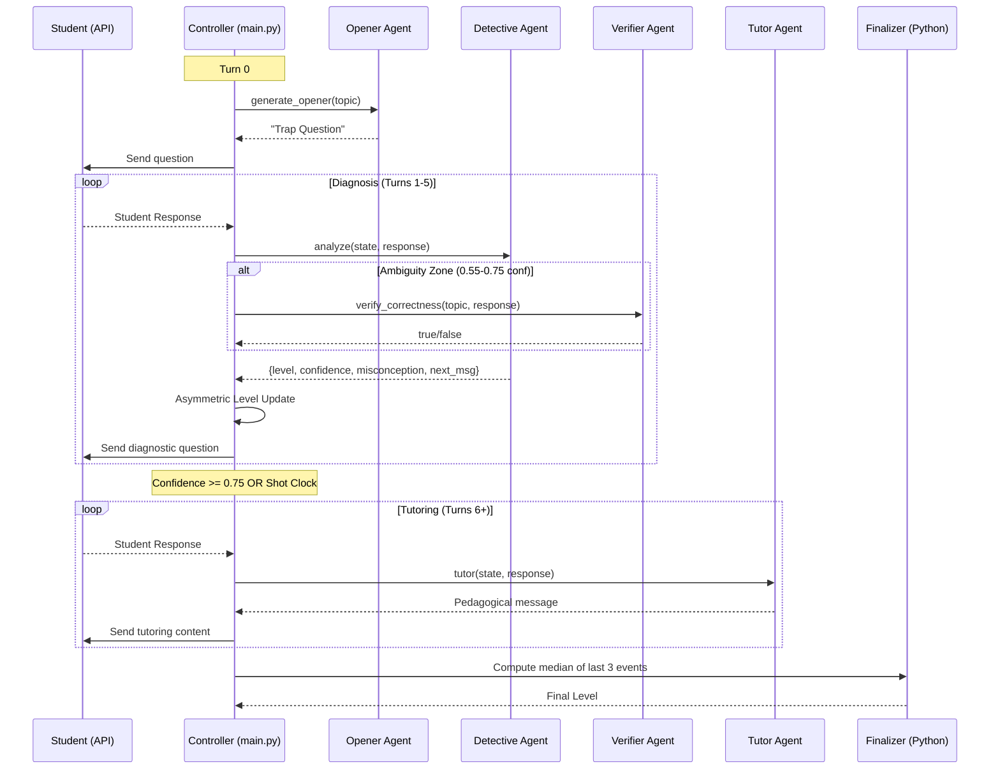

# AI Tutor Agents & Pipeline

> A detailed breakdown of every agent in our system, their purpose, and when they are called.

---

## 🏗️ System Overview

Our system is a **Multi-Agent Orchestration** pattern where the Python Controller (`main.py`) acts as the "brain" that decides which LLM agent to invoke based on the current state.



---

## 🤖 Agent 1: The Opener

| Property | Value |
|----------|-------|
| **File** | `prompts.py` → `OPENER` |
| **When Called** | Turn 0 only |
| **Purpose** | Deploy a "Conceptual Trap" question |
| **Reasoning Effort** | High |

### What It Does
Instead of saying "Hello, I'm your tutor," the Opener immediately asks a diagnostic question designed to reveal common misconceptions for that specific topic.

### Example Output
> "A line passes through the points (2, 5) and (2, −1). Someone says, 'The slope is 0.' Do you agree?"

---

## 🔍 Agent 2: The Detective

| Property | Value |
|----------|-------|
| **File** | `prompts.py` → `DETECTIVE` |
| **When Called** | Turns 1-5, while `confidence < 0.75` |
| **Purpose** | Analyze student response, extract evidence |
| **Reasoning Effort** | High |
| **Output** | Structured JSON (not student-facing text) |

### What It Does
Evaluates the student's response for:
- **Correctness**: Is the answer factually correct?
- **Reasoning Score**: Quality of explanation (1-5)
- **Misconception**: Any concrete incorrect belief
- **Estimated Level**: LLM's guess at student level (1-5)
- **Confidence**: Certainty in the estimate

### Key Design
The Detective is a **feature extractor**, not a judge. The Controller uses asymmetric rules to decide the actual level:
- **Promotion**: Requires 2 consecutive "promote" votes
- **Demotion**: Requires strong evidence (wrong + reasoning ≤ 2)

---

## ✅ Agent 3: The Verifier

| Property | Value |
|----------|-------|
| **File** | `llm.py` → `verify_correctness()` |
| **When Called** | Only in Ambiguity Zone (0.55-0.75 confidence) |
| **Purpose** | Double-check factual correctness |
| **Reasoning Effort** | Low (fast check) |
| **Output** | `true` or `false` |

### What It Does
A lightweight second opinion on whether the student's answer is factually correct. If it disagrees with the Detective, the Verifier's judgment is trusted.

### Why It Exists
LLMs can be "noisy" in ambiguous cases. The Verifier reduces variance without adding latency to clear-cut cases.

---

## 🎓 Agent 4: The Tutor (3 Personas)

| Property | Value |
|----------|-------|
| **File** | `prompts.py` → `TUTOR_COACH`, `TUTOR_PROFESSOR`, `TUTOR_COLLEAGUE` |
| **When Called** | After level is frozen (confidence ≥ 0.75 or Shot Clock) |
| **Purpose** | Teach adaptively based on diagnosed level |
| **Reasoning Effort** | Medium |

### Personas by Level

| Level | Persona | Style |
|-------|---------|-------|
| 1-2 | **The Coach** | Warm, encouraging, simple examples, builds confidence |
| 3-4 | **The Professor** | Socratic, conceptual challenges, "What if?" questions |
| 5 | **The Colleague** | Peer-to-peer, edge cases, nuanced discussion |

---

## 🧮 Agent 5: The Finalizer (Deterministic)

| Property | Value |
|----------|-------|
| **File** | `main.py` (pure Python, no LLM) |
| **When Called** | End of session |
| **Purpose** | Stabilize the final level prediction |
| **Latency** | 0ms |

### What It Does
Computes the **median of the last 3 diagnostic events** to prevent "last-turn swing" from ruining MSE.

### When It Adjusts
- If `switch_reason == "shot_clock"` (ambiguous case)
- If `confidence < 0.75` at end of session

---

## 📊 State Management

All evidence is logged in `StudentState.diagnostic_events[]`:

```python
class DiagnosticEvent(BaseModel):
    turn: int
    is_correct: bool
    reasoning_score: int  # 1-5
    misconception: Optional[str]
    llm_level: int        # What LLM suggested
    computed_level: int   # What we actually set
    confidence: float
```

This enables:
- Post-hoc analysis of diagnosis quality
- Deterministic finalizer computation
- Clean data for future model training
