# AI Tutor Agents

> All 5 agents, their GPT-5.2 patterns, and when they're called.

---

## 🏗️ Agent Overview

```mermaid
graph LR
    subgraph "Turn 0"
        O[🎯 Opener]
    end
    
    subgraph "Turns 1-5 (Diagnosis)"
        D[🔍 Detective]
        V[✅ Verifier]
    end
    
    subgraph "Turns 6+ (Tutoring)"
        T1[🧑‍🏫 Coach L1-2]
        T2[🎓 Professor L3-4]
        T3[🤝 Colleague L5]
    end
    
    subgraph "End"
        F[📊 Finalizer]
    end
    
    O --> D
    D -->|"Ambiguity 0.50-0.65"| V
    V --> D
    D -->|"Frozen"| T1
    D -->|"Frozen"| T2
    D -->|"Frozen"| T3
    T1 --> F
    T2 --> F
    T3 --> F
```



---

## 🎯 Agent 1: Opener

| Property | Value |
|----------|-------|
| **Prompt** | `prompts.py` → `OPENER` |
| **When** | Turn 0 only |
| **Model** | gpt-5.2-pro (high reasoning) |
| **GPT-5.2 Pattern** | `<discriminative_power>` |

### Purpose
Deploy a "Conceptual Trap" question that separates skill levels.

### Key Pattern
```xml
<discriminative_power>
- Level 1 should reveal specific misconception
- Level 3 should get it right with basic reasoning
- Level 5 should give deeper insight
</discriminative_power>
```

---

## 🔍 Agent 2: Detective

| Property | Value |
|----------|-------|
| **Prompt** | `prompts.py` → `DETECTIVE` |
| **When** | Turns 1-5, while `confidence < 0.75` |
| **Model** | gpt-5.2-pro (high reasoning) |
| **GPT-5.2 Patterns** | `<calibration_rules>`, `<self_check>`, `<next_message_rules>` |

### Purpose
Analyze student response, extract evidence, output structured JSON.

### Key Patterns
```xml
<calibration_rules>
- 0.9+: Bet your reputation
- 0.6-0.8: Could be off by 1 level
- <0.6: Multiple interpretations
</calibration_rules>

<next_message_rules>
- Level 1-2: "Can you walk me through that?"
- Level 3: "What if we changed X to Y?"
- Level 4-5: "Does this still hold when Z?"
</next_message_rules>
```

---

## ✅ Agent 3: Verifier

| Property | Value |
|----------|-------|
| **Code** | `llm.py` → `verify_correctness()` |
| **When** | Ambiguity zone (0.50-0.65 confidence) |
| **Model** | gpt-5.2 (medium reasoning) - FAST |
| **Output** | `true` or `false` |

### Purpose
Lightweight double-check on factual correctness. If disagreement with Detective, trust Verifier.

---

## 🎓 Agent 4: Tutor (3 Personas)

| Level | Persona | Style |
|-------|---------|-------|
| 1-2 | **Coach** | Warm, simple examples, builds confidence |
| 3-4 | **Professor** | Socratic "what if?" questions |
| 5 | **Colleague** | Edge cases, peer-level discussion |

### Common Pattern
```xml
<output_verbosity>
- 2-4 sentences max
- No preambles ("Great question!")
- Get straight to teaching
</output_verbosity>
```

---

## 📊 Agent 5: Finalizer (Deterministic)

| Property | Value |
|----------|-------|
| **Code** | `main.py` (pure Python, no LLM) |
| **When** | End of session |
| **Latency** | 0ms |

### Purpose
Compute **median of last 3 diagnostic events** to prevent last-turn swing.

```python
if len(events) >= 3:
    final_level = median([e.computed_level for e in events[-3:]])
```

---

## 📈 Agent Invocation Flow

```mermaid
sequenceDiagram
    participant S as Student
    participant C as Controller
    participant O as Opener
    participant D as Detective
    participant V as Verifier
    participant T as Tutor
    participant F as Finalizer

    C->>O: generate_opener(topic)
    O-->>C: Trap question
    C->>S: Send question
    
    loop Diagnosis (Turns 1-5)
        S-->>C: Response
        C->>D: analyze(state, response)
        alt Ambiguity Zone
            C->>V: verify_correctness()
            V-->>C: true/false
        end
        D-->>C: {level, confidence, next_msg}
        alt Early Exit (conf ≥0.85 + 3 events)
            C->>C: Freeze level
        end
        C->>S: Diagnostic question
    end
    
    loop Tutoring (Level Frozen)
        S-->>C: Response
        C->>T: tutor(persona, response)
        T-->>C: Teaching message
        C->>S: Tutoring content
    end
    
    C->>F: median(last_3_events)
    F-->>C: Final level
```



---

## 🧠 State Tracking

```python
class DiagnosticEvent(BaseModel):
    turn: int
    is_correct: bool
    reasoning_score: int    # 1-5
    llm_level: int          # LLM's estimate
    computed_level: int     # Actual level after rules
    confidence: float
```

Enables:
- Deterministic finalizer computation
- Post-hoc analysis
- Submission history tracking
