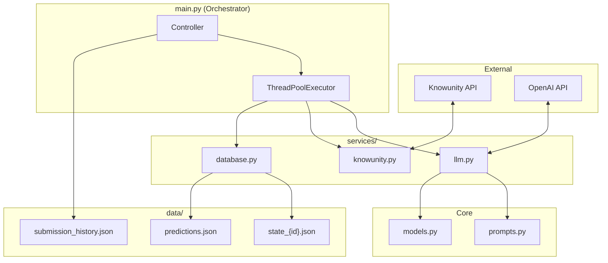
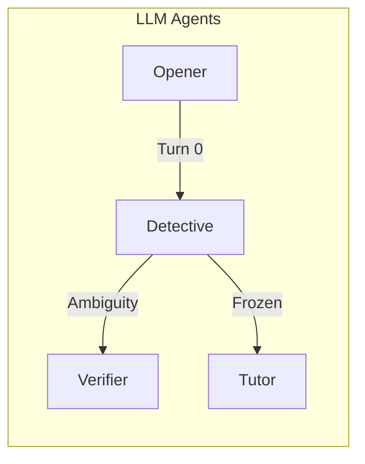
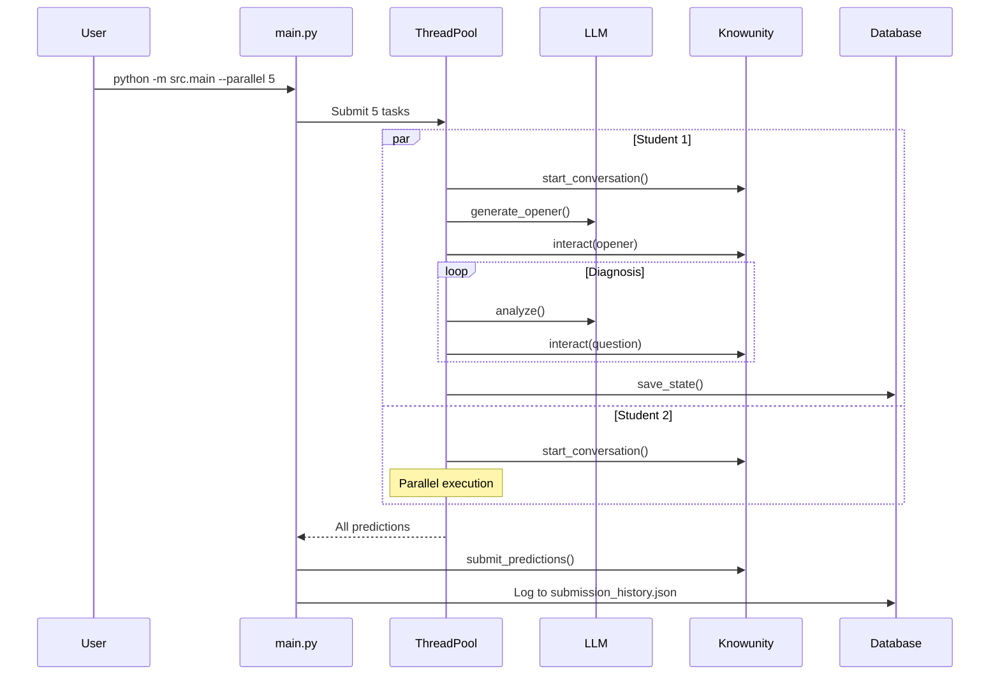

# System Architecture

> Modular, parallel-ready AI Tutor with GPT-5.2-pro.

---

## 🏗️ High-Level Architecture



---

## 📦 Component Breakdown

### 1. **main.py** - Orchestrator
- Parallel processing via `ThreadPoolExecutor`
- State machine: Diagnosis → Tutoring
- Submission history logging
- Error handling with fallback

### 2. **services/llm.py** - LLM Agents


| Agent | Model | Reasoning |
|-------|-------|-----------|
| Opener | gpt-5.2-pro | high |
| Detective | gpt-5.2-pro | high |
| Verifier | gpt-5.2 | medium |
| Tutor | gpt-5.2-pro | medium |

### 3. **services/database.py** - Per-Student State
```
data/
├── state_1c6afe74.json   # Student 1
├── state_2ee4a025.json   # Student 2
├── predictions.json       # Final output
└── submission_history.json # MSE tracking
```

Parallel-safe: Each student writes to own file.

### 4. **models.py** - Data Contracts

```python
class DiagnosticEvent(BaseModel):
    turn: int
    is_correct: bool
    reasoning_score: int
    llm_level: int
    computed_level: int
    confidence: float

class StudentState(BaseModel):
    student_id: str
    estimated_level: int
    confidence: float
    diagnostic_events: List[DiagnosticEvent]
```

### 5. **prompts.py** - GPT-5.2 Patterns

| Prompt | Pattern |
|--------|---------|
| OPENER | `<discriminative_power>` |
| DETECTIVE | `<calibration_rules>`, `<self_check>`, `<next_message_rules>` |
| TUTOR | `<output_verbosity>`, persona-specific |

---

## 🔄 Request Flow



---

## ⚙️ Configuration

| Variable | Description |
|----------|-------------|
| `OPENAI_API_KEY` | OpenAI API key |
| `KNOWUNITY_X_API_KEY` | Hackathon API key |
| `SET_TYPE` | mini_dev / dev / eval |
| `LOG_LEVEL` | INFO / DEBUG |

---

## 🚀 CLI Flags

| Flag | Default | Description |
|------|---------|-------------|
| `--parallel N` | 1 | Concurrent students |
| `--turns N` | 10 | Turns per session |
| `--max-convos N` | 0 | Limit (0=all) |
| `--submit` | false | Submit + log history |
| `--set-type` | mini_dev | Dataset |

---

## 📊 Observability

```python
# Per-student logging
log.info(f"[{student_name}] [DIAGNOSIS Turn {turn}] Level={level} Conf={conf}")
log.info(f"[{student_name}] >>> EARLY EXIT: High confidence")
```

Logs are prefixed with student name for parallel clarity.
