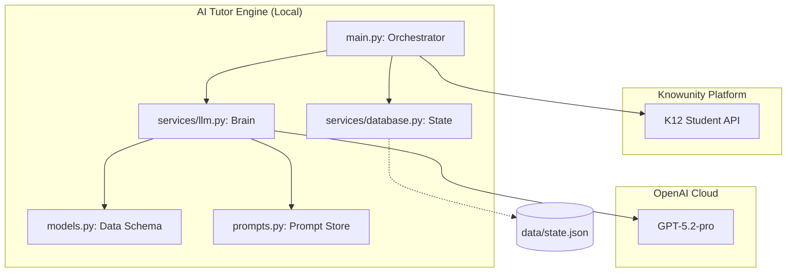
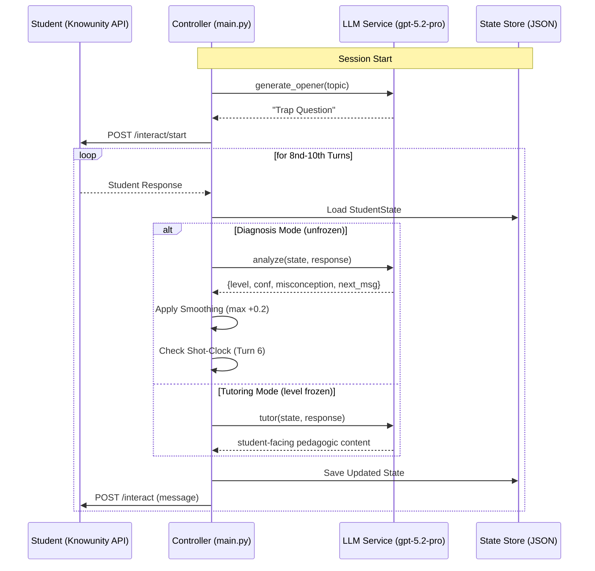

# System Architecture

> A clean, modular design for our AI Tutor system.

---

## 🏗️ High-Level Component View

---

## 🔄 Interaction Sequence

The following diagram illustrates a single interaction loop, highlighting the transition from diagnosis to tutoring.

---

## 🛠️ The Technical Stack

### 1. **gpt-5.2-pro** (The "Brain")
We utilize the advanced reasoning capabilities of `gpt-5.2-pro` for all phases:
- **Reasoning Effort**: Set to `high` for diagnosis and `medium` for tutoring to balance depth vs latency.
- **Responses API**: Direct integration with the New OpenAI Responses API for optimized instruction following.

### 2. **Pydantic & JSON Schema** (The "Glue")
The **Detective** doesn't just return text; it returns a strict `DetectiveOutput` JSON.
- **Reliability**: Eliminates the need for fragile regex parsing.
- **Type Safety**: Ensure the controller always gets valid `confidence` and `estimated_level` integers.

### 3. **Deterministic State Machine** (The "Controller")
While the LLM provides signals, the **Python Controller** makes the life-or-death decisions:
- **Confidence Smoothing**: Prevents a single lucky guess from inflating confidence.
- **Level Freezing**: Locks the diagnosis once `confidence >= 0.75` to prevent late-game drift.
- **Shot Clock**: Guarantees tutoring starts by Turn 6, even if signals are weak.

---

## ✍️ Prompt Engineering Patterns

Our `prompts.py` utilizes modern patterns to maximize LLM performance:

### XML-like Tagging
We use `<task>`, `<context>`, and `<constraints>` tags to clearly demarcate instructions. This helps `gpt-5.2` prioritize system goals over user-injected text.

### Zero-Shot Chain of Thought
The `DETECTIVE` prompt is instructed to:
- Evaluate **Correctness**
- Measure **Depth**
- Identify **Misconceptions**
- *Before* outputting the final level and confidence.

### Level-Adaptive Personas
We don't use a single "Tutor" persona. Instead, we scale the tone and Socratic depth:
- **Coach (L1-2)**: High scaffolding, simple vocabulary, positive reinforcement.
- **Professor (L3-4)**: Socratic method, conceptual challenges, deep-dives.
- **Colleague (L5)**: High-level peer discussion, edge cases, minimal scaffolding.

---

## 📊 State Management (`StudentState`)

We persist the full state in `data/state.json` after every turn.

| Field | Purpose |
|-------|---------|
| `history` | List of `Message` objects for LLM context |
| `turn_count` | Limits diagnostic turns vs tutoring turns |
| `estimated_level` | The "Golden Metric" for the MSE score |
| `confidence` | Used to trigger the phase transition |
| `misconceptions` | Key list of items the Tutor must address |
