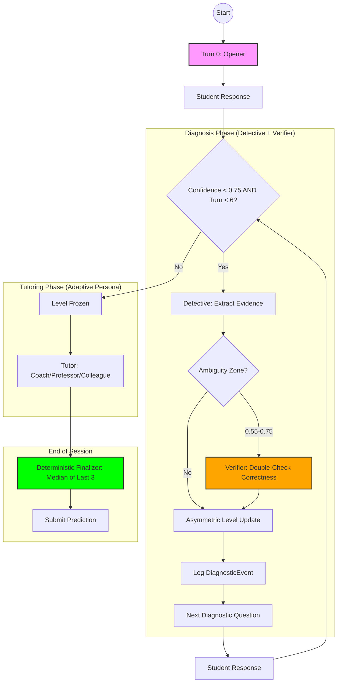

# The Strategy: "The Peer-Reviewed Detective"

> Our system implements a Bayesian-inspired Knowledge Tracing approach disguised as a tutor.

---

## 🎯 Core Philosophy

We don't just ask random questions. We strategically probe the student's knowledge using **information-maximizing questions** that reveal their true understanding level as quickly as possible.

---

## 📊 The Conversation Flow

Our state machine manages three distinct phases to ensure both accurate diagnosis and quality tutoring.



---

## Phase 1: Diagnosis (Turns 0-5)

### Turn 0: The Opener
- Ask a **"Conceptual Trap Question"** - designed to distinguish surface knowledge from deep understanding.
- **Output Spec**: A single question (1-2 sentences max) that reveals misconceptions.

### Turns 1-5: The Detective
Each turn, the **GPT-5.2-pro** model analyzes the response:
1. **Focus**: Primarily on the most recent response.
2. **Context**: Use history only to detect consistency or contradiction.
3. **Structured Output**: JSON format for `is_correct`, `reasoning_score`, `misconception`, `estimated_level`, and `confidence`.

---

## 🧠 MSE-Reducing Signal Processing

We implement **5 layers** of statistical calibration to reduce MSE:

### 1. Asymmetric Level Updates
LLM is a **feature extractor**, Controller makes the decision:
```python
# Promotion: Require 2 consecutive votes
if llm_level > old_level:
    promo_votes += 1
    if promo_votes >= 2:
        level += 1

# Demotion: Require strong evidence
if llm_level < old_level:
    if not is_correct and reasoning_score <= 2:
        level -= 1
```

### 2. Confidence Smoothing
Prevents spikes and regressions:
```python
smoothed_conf = min(prev_confidence + 0.15, raw_confidence)
```

### 3. The Verifier (Ambiguity Zone)
Runs **only when 0.55 ≤ confidence ≤ 0.75**. If it disagrees with Detective on correctness, trust the Verifier.

### 4. Diagnostic Event Logging
Every diagnosis turn logs structured evidence:
```python
DiagnosticEvent(turn, is_correct, reasoning_score, llm_level, computed_level, confidence)
```

### 5. Deterministic Finalizer
At end of session, compute **median of last 3 events** to prevent "last-turn swing":
```python
if switch_reason == "shot_clock" or confidence < 0.75:
    final_level = median(last_3_computed_levels)
```

---

## Phase 2: Tutoring (Turn 6+ OR Confidence >= 0.75)

Once the level is frozen, we switch to an **Adaptive Persona**.

### Official Understanding Levels
| Level | Official Meaning | Persona Type |
|---|---|---|
| 1 | Struggling | **The Coach** (Warm, encourages, simple examples) |
| 2 | Below grade | **The Coach** (Scaffolding, builds confidence) |
| 3 | At grade | **The Professor** (Socratic, "What if?" questions) |
| 4 | Above grade | **The Professor** (Challenging, practical apps) |
| 5 | Advanced | **The Colleague** (Nuanced, edge cases, peers) |

---

## 🎯 Scoring Stability Features

| Feature | Logic | Benefit |
|---------|-------|---------|
| **Asymmetric Updates** | 2 votes for promotion | Prevents single-turn jumps |
| **Confidence Smoothing** | `max +0.15 / turn` | Slower, more stable transitions |
| **Verifier** | Ambiguity zone only | Reduces correctness noise |
| **Shot Clock (Turn 6)** | Mandatory switch | Guarantees tutoring score |
| **Deterministic Finalizer** | Median of last 3 | Prevents last-turn swing |

---

## 📊 Expected Outcomes

- **MSE < 0.5**: Multi-layer calibration reduces variance.
- **Tutoring Score > 8**: Persona-aligned adaptive teaching.
- **Robustness**: 100% completion rate via fail-safe shot-clock + finalizer.
