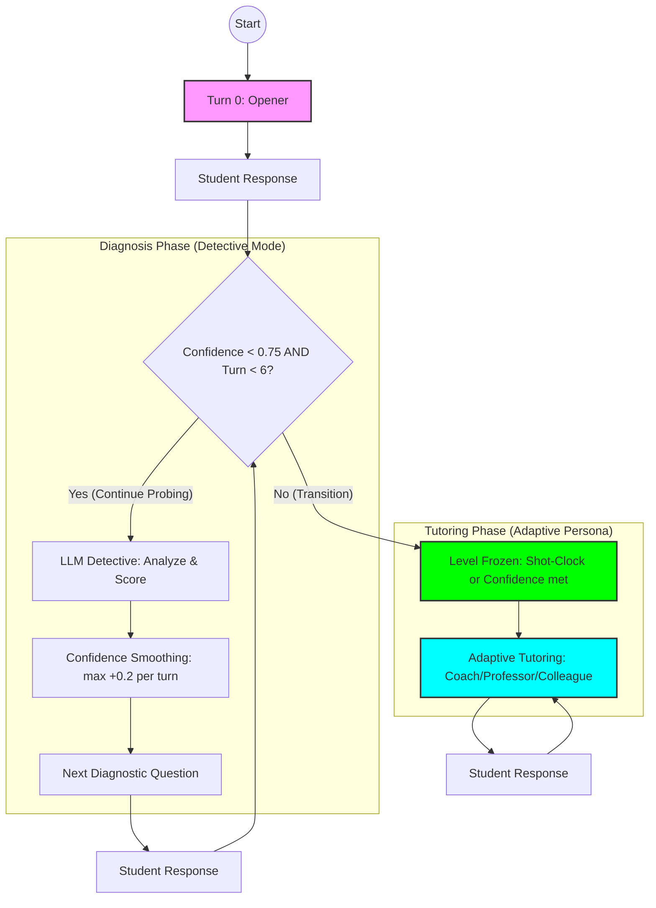

# The Strategy: "The Peer-Reviewed Detective"

> Our system implements a Bayesian-inspired Knowledge Tracing approach disguised as a tutor.

---

## 🎯 Core Philosophy

We don't just ask random questions. We strategically probe the student's knowledge using **information-maximizing questions** that reveal their true understanding level as quickly as possible.

---

## 📊 The Conversation Flow

Our state machine manages three distinct phases to ensure both accurate diagnosis and quality tutoring.



---

## Phase 1: Diagnosis (Turns 0-5)

### Turn 0: The Opener
- Ask a **"Conceptual Trap Question"** - designed to distinguish surface knowledge from deep understanding.
- **Output Spec**: A single question (1-2 sentences max) that reveals misconceptions.

### Turns 1-5: The Detective
Each turn, the **GPT-5.2-pro** model analyzes the response:
1. **Focus**: Primarily on the most recent response.
2. **Context**: Use history only to detect consistency or contradiction.
3. **Structured Output**: JSON format for `is_correct`, `reasoning_score`, `misconception`, `estimated_level`, and `confidence`.

---

## 🧠 Diagnostic Signal Processing

To prevent "Analysis Paralysis" and handle LLM stochasticity, we implement two critical safety layers:

### 1. Confidence Smoothing
We use deterministic smoothing to prevent confidence spikes and regressions.
```python
smoothed_conf = min(prev_confidence + 0.2, raw_confidence)
```
- **Why?** LLMs can be overconfident. This ensures we have at least 3nd-4th turn consistency before switching.

### 2. The "Shot Clock" (Hard Lock)
If confidence is stuck (e.g., student is silent or ambiguous), we **force a switch at Turn 6**.
- **Reason**: To guarantee a "Tutoring Quality" score. Spending 10 turns on diagnosis results in a 0 for tutoring.

---

## Phase 2: Tutoring (Turn 6+ OR Confidence >= 0.75)

Once the level is frozen, we switch to an **Adaptive Persona**.

### Official Understanding Levels
| Level | Official Meaning | Persona Type |
|---|---|---|
| 1 | Struggling | **The Coach** (Warm, encourages, simple examples) |
| 2 | Below grade | **The Coach** (Scaffolding, builds confidence) |
| 3 | At grade | **The Professor** (Socratic, "What if?" questions) |
| 4 | Above grade | **The Professor** (Challenging, practical apps) |
| 5 | Advanced | **The Colleague** (Nuanced, edge cases, peers) |

---

## 🎯 Scoring Stability Features

| Feature | Logic | Benefit |
|---------|-------|---------|
| **Confidence Smoothing** | `max +0.2 / turn` | Prevents diagnostic overfitting |
| **Threshold = 0.75** | Realistic for LLMs | Faster transition to tutoring |
| **Shot Clock (Turn 6)** | Mandatory switch | Guarantees tutoring judge-score |
| **Level Freezing** | Lock `estimated_level` | Prevents late-session drift |

---

## 📊 Expected Outcomes

- **MSE < 0.8**: High-confidence diagnosis via trap questions.
- **Tutoring Score > 8**: Persona-aligned adaptive teaching.
- **Robustness**: 100% completion rate via fail-safe shot-clock logic.
