# The Strategy: "The Peer-Reviewed Detective"

> Bayesian-inspired Knowledge Tracing + GPT-5.2 prompt patterns for optimal MSE.

---

## 🎯 Core Philosophy

We use **discriminative trap questions** and **calibrated confidence** to infer student level with minimal turns.

---

## 📊 The Conversation Flow

```mermaid
graph TD
    Start((Start)) --> Opener[Turn 0: Opener]
    Opener --> StudentResponse1[Student Response]
    
    subgraph "Diagnosis Phase"
    Diagnosis{Conf < 0.75 AND Turn < 6?}
    Analyze[Detective: Calibrated Analysis]
    EarlyExit{Conf ≥0.85 + 3 events?}
    Asymmetric[Asymmetric Level Update]
    NextDiag[Next Diagnostic Question]
    end
    
    subgraph "Tutoring Phase"
    Freeze[Level Frozen]
    Tutor[Adaptive Persona]
    end
    
    subgraph "End"
    Finalizer[Median of Last 3]
    Submit[Submit]
    end
    
    StudentResponse1 --> Diagnosis
    Diagnosis -- "Yes" --> Analyze
    Analyze --> EarlyExit
    EarlyExit -- "Yes" --> Freeze
    EarlyExit -- "No" --> Asymmetric
    Asymmetric --> NextDiag
    NextDiag --> Diagnosis
    
    Diagnosis -- "No" --> Freeze
    Freeze --> Tutor
    Tutor --> Finalizer
    Finalizer --> Submit
```



---

## 🧠 GPT-5.2 Prompt Patterns

### OPENER: `<discriminative_power>`
```xml
<discriminative_power>
- Level 1 should reveal specific misconception
- Level 3 should get it right with basic reasoning
- Level 5 should give deeper insight
</discriminative_power>
```

### DETECTIVE: `<calibration_rules>` + `<self_check>`
```xml
<calibration_rules>
- 0.9+: Bet your reputation
- 0.6-0.8: Could be off by 1 level
- <0.6: Multiple interpretations
</calibration_rules>

<self_check>
- Did I anchor on MOST RECENT response?
- Is my confidence calibrated?
</self_check>
```

---

## 📈 MSE-Reducing Layers

### 1. Asymmetric Level Updates
```python
# Promotion: 2 consecutive votes
if llm_level > old_level:
    promo_votes += 1
    if promo_votes >= 2: level += 1

# Demotion: Strong evidence only
if llm_level < old_level:
    if not is_correct and reasoning_score <= 2:
        level -= 1
```

### 2. First-2 Baseline
Average of turns 1-2 sets baseline, then asymmetric rules apply.

### 3. Confidence Smoothing
```python
smoothed_conf = min(prev_conf + 0.15, raw_conf)
```

### 4. Early Exit Optimization
```python
if conf >= 0.85 and is_correct and reasoning >= 4 and events >= 3:
    freeze_level()  # Skip remaining diagnosis
```

### 5. Verifier (Ambiguity Zone)
Runs only when 0.50 ≤ confidence ≤ 0.65. Uses fast gpt-5.2 model.

### 6. Deterministic Finalizer
```python
if uncertain: final_level = median(last_3_computed_levels)
```

---

## 🎭 Adaptive Tutoring Personas

| Level | Persona | Style |
|-------|---------|-------|
| 1-2 | **Coach** | Warm, simple examples, builds confidence |
| 3-4 | **Professor** | Socratic "what if?" questions |
| 5 | **Colleague** | Edge cases, nuanced discussion |

---

## ⚡ Parallel Processing

```bash
python -m src.main --parallel 5 --submit
```

- Uses `ThreadPoolExecutor` for concurrent students
- Auto-caps workers to number of tasks
- Per-student state files prevent conflicts
- Submission history logged for trend analysis

---

## 📊 Scoring Stability

| Feature | Logic | Benefit |
|---------|-------|---------|
| Asymmetric Updates | 2 votes for +1 | No single-turn jumps |
| Confidence Smoothing | +0.15/turn max | Stable transitions |
| Early Exit | ≥0.85 + 3 events | Faster + more tutoring |
| Shot Clock (T6) | Mandatory switch | Guarantees tutoring |
| Finalizer | Median of 3 | No last-turn swing |
